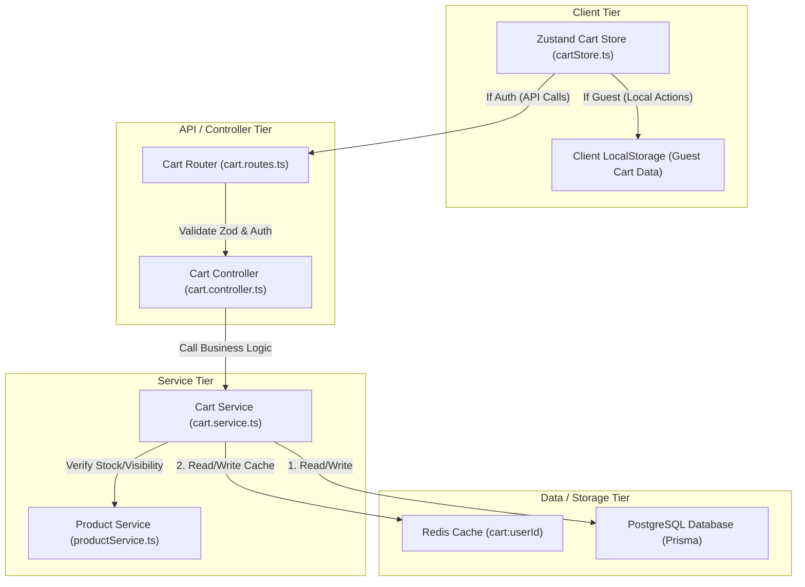

# M7 Execution Plan: Production-Grade Cart System

This document outlines the detailed architecture, design, and implementation plan for **Milestone 7 (M7) - Cart System** in the ShopSmart project. 

The cart system utilizes a multi-tiered architecture consisting of:
1. A client-side Zustand store (persisted in `localStorage` for guests and synced with the backend for authenticated users).
2. A stateless REST API backend.
3. A Postgres database (via Prisma ORM) as the ultimate source of truth.
4. A Redis cache layer to speed up cart retrievals and reduce database load.

---

## 1. Cart Architecture



The system separates cart data lifecycle between guest and authenticated states:
*   **Guest state**: Cart items are manipulated entirely client-side via a Zustand store, serialized to browser `localStorage` using Zustand's `persist` middleware. No server database overhead or sessions are generated.
*   **Authenticated state**: Cart items are persisted in the database (`carts` and `cart_items` tables) and cached in Redis. When the user loads their cart, the frontend fetches the cart state from the backend. The Zustand store is populated with the server state.

---

## 2. API Design

All endpoints (except the public stock-check and guest merges) require a valid JWT token. The endpoints conform to ShopSmart's consistent response envelope.

### Endpoint Specifications

#### 1. `GET /api/cart`
*   **Description**: Retrieves the current authenticated user's cart (items, product snapshots, and calculated totals).
*   **Authentication**: Required.
*   **Authorization Permission**: `cart:read`
*   **Query Parameters**: None.
*   **Success Response (200 OK)**:
    ```json
    {
      "success": true,
      "data": {
        "id": "c138d387-9eb5-430c-99fb-628d6c7cb52d",
        "userId": "u732b123-f222-4411-bd56-118c7b8cb55a",
        "items": [
          {
            "id": "ci928d11-12ef-45fa-bb22-882d2c1cb82a",
            "productId": "p222d387-f888-4aaa-ba22-882d2c1cb82b",
            "quantity": 2,
            "product": {
              "id": "p222d387-f888-4aaa-ba22-882d2c1cb82b",
              "name": "Wireless Mechanical Keyboard",
              "slug": "wireless-mechanical-keyboard",
              "basePrice": "89.99",
              "comparePrice": "109.99",
              "stock": 15,
              "images": ["https://assets.shopsmart.com/kbd.jpg"],
              "isVisible": true
            },
            "warnings": []
          }
        ],
        "totalItems": 2,
        "subtotal": "179.98"
      }
    }
    ```

#### 2. `POST /api/cart/items`
*   **Description**: Adds an item to the authenticated user's cart. If the product is already in the cart, increments the quantity.
*   **Authentication**: Required.
*   **Authorization Permission**: `cart:write`
*   **Request Body**:
    ```json
    {
      "productId": "p222d387-f888-4aaa-ba22-882d2c1cb82b",
      "quantity": 2
    }
    ```
*   **Success Response (201 Created)**:
    ```json
    {
      "success": true,
      "data": {
        "id": "c138d387-9eb5-430c-99fb-628d6c7cb52d",
        "userId": "u732b123-f222-4411-bd56-118c7b8cb55a",
        "items": [ ... ],
        "totalItems": 2,
        "subtotal": "179.98"
      }
    }
    ```

#### 3. `PUT /api/cart/items/:productId`
*   **Description**: Updates the quantity of a specific product in the cart to a new absolute quantity.
*   **Authentication**: Required.
*   **Authorization Permission**: `cart:write`
*   **URL Parameter**: `productId` (UUID)
*   **Request Body**:
    ```json
    {
      "quantity": 5
    }
    ```
*   **Success Response (200 OK)**:
    ```json
    {
      "success": true,
      "data": {
        "id": "c138d387-9eb5-430c-99fb-628d6c7cb52d",
        "items": [ ... ],
        "totalItems": 5,
        "subtotal": "449.95"
      }
    }
    ```

#### 4. `DELETE /api/cart/items/:productId`
*   **Description**: Removes an item completely from the authenticated user's cart.
*   **Authentication**: Required.
*   **Authorization Permission**: `cart:write`
*   **URL Parameter**: `productId` (UUID)
*   **Success Response (200 OK)**:
    ```json
    {
      "success": true,
      "data": {
        "id": "c138d387-9eb5-430c-99fb-628d6c7cb52d",
        "items": [],
        "totalItems": 0,
        "subtotal": "0.00"
      }
    }
    ```

#### 5. `DELETE /api/cart`
*   **Description**: Clears all items in the user's cart.
*   **Authentication**: Required.
*   **Authorization Permission**: `cart:write`
*   **Success Response (200 OK)**:
    ```json
    {
      "success": true,
      "data": {
        "message": "Cart cleared successfully"
      }
    }
    ```

#### 6. `POST /api/cart/merge`
*   **Description**: Merges client-side guest cart items into the authenticated database cart. Called during login.
*   **Authentication**: Required.
*   **Authorization Permission**: `cart:write`
*   **Request Body**:
    ```json
    {
      "items": [
        { "productId": "p222d387-f888-4aaa-ba22-882d2c1cb82b", "quantity": 1 },
        { "productId": "p333d387-f888-4aaa-ba22-882d2c1cb82c", "quantity": 3 }
      ]
    }
    ```
*   **Success Response (200 OK)**: Returns the fully merged cart response details.

---

## 3. Service Layer Design

The service layer (`cart.service.ts`) will encapsulate all cart manipulation logic, interfacing directly with Prisma and Redis.

```typescript
export interface CartWithItems {
  id: string;
  userId: string;
  items: Array<{
    id: string;
    productId: string;
    quantity: number;
    product: {
      id: string;
      name: string;
      slug: string;
      basePrice: any; // Prisma.Decimal
      comparePrice: any; // Prisma.Decimal | null
      stock: number;
      images: string[];
      isVisible: boolean;
    };
  }>;
}

export interface CartResponseDto {
  id: string;
  userId: string;
  items: Array<any>;
  totalItems: number;
  subtotal: string;
}

class CartService {
  /**
   * Safe helper to retrieve a user's cart, creating it on-demand if missing (e.g. seeded/legacy users).
   */
  async getOrCreateCart(userId: string, tx?: any): Promise<any> { ... }

  /**
   * Retrieves cart. Implements Cache-Aside (Read-Through Redis).
   */
  async getCart(userId: string): Promise<CartResponseDto> { ... }

  /**
   * Adds an item to the cart. Validates product existence, visibility, and stock.
   */
  async addItem(userId: string, productId: string, quantity: number): Promise<CartResponseDto> { ... }

  /**
   * Updates an item's quantity.
   */
  async updateQuantity(userId: string, productId: string, quantity: number): Promise<CartResponseDto> { ... }

  /**
   * Removes an item from the cart.
   */
  async removeItem(userId: string, productId: string): Promise<CartResponseDto> { ... }

  /**
   * Clears all items in the cart.
   */
  async clearCart(userId: string): Promise<void> { ... }

  /**
   * Merges guest items into user's authenticated cart.
   */
  async mergeCart(userId: string, items: Array<{ productId: string; quantity: number }>): Promise<CartResponseDto> { ... }

  /**
   * Helper to format a DB cart record into a clean DTO with Decimal currency formats.
   */
  private formatCart(cart: CartWithItems): CartResponseDto { ... }
}
```

---

## 4. Validation Strategy

All input values from client payloads will be validated strictly at the routing layer using Zod schema validators before entering the controller.

### Zod Schemas

1.  **Add Item Schema**:
    ```typescript
    export const addToCartSchema = z.object({
      productId: z.string().uuid({ message: "Invalid product ID format." }),
      quantity: z.number().int().positive({ message: "Quantity must be at least 1." })
        .max(10, { message: "Maximum quantity per item in a cart is 10." }),
    });
    ```
2.  **Update Quantity Schema**:
    ```typescript
    export const updateCartItemSchema = z.object({
      quantity: z.number().int().positive({ message: "Quantity must be at least 1." })
        .max(10, { message: "Maximum quantity per item in a cart is 10." }),
    });
    ```
3.  **Merge Cart Schema**:
    ```typescript
    export const mergeCartSchema = z.object({
      items: z.array(
        z.object({
          productId: z.string().uuid({ message: "Invalid product ID format." }),
          quantity: z.number().int().positive({ message: "Quantity must be at least 1." })
            .max(10, { message: "Maximum quantity per item in a cart is 10." }),
        })
      )
      .max(50, { message: "Cannot merge guest cart containing more than 50 unique items." }),
    });
    ```
4.  **Product Parameter Schema**:
    ```typescript
    export const productIdParamSchema = z.object({
      productId: z.string().uuid({ message: "Invalid product ID parameter." }),
    });
    ```

---

## 5. Redis Strategy

To optimize API performance under high read conditions, we will employ a **Cache-Aside (Read-Through/Write-Through)** pattern:

*   **Key Design**: `cart:${userId}`
*   **TTL Configuration**: 1 hour (3600 seconds) since carts change frequently but should be kept warm for active sessions.
*   **Cache Reads**:
    *   `GET /api/cart` searches for `cart:${userId}` in Redis.
    *   On hit: Parse JSON and return to user immediately (Response time: < 3ms).
    *   On miss: Query Postgres via Prisma, reconstruct the full cart DTO, set the stringified JSON back to Redis with TTL, and return.
*   **Cache Invalidation**:
    *   Any write endpoint (`addItem`, `updateQuantity`, `removeItem`, `clearCart`, `mergeCart`) must run its database write successfully first.
    *   Immediately following the successful database transaction, the service will delete the Redis key `cart:${userId}` (to prevent split-brain/stale cache reads). The next read will naturally populate it with fresh data.
*   **Failover & Resiliency**:
    *   If Redis is unreachable, all operations must fail open (catch Redis connectivity exceptions, log them via Winston, and access/write PostgreSQL directly).

---

## 6. Cart Merge Strategy

When a guest user logs in:
1.  The frontend reads the guest cart items stored in browser `localStorage`.
2.  If the guest cart has items, it triggers `POST /api/cart/merge` sending the item array.
3.  The server fetches the user's DB cart (using `getOrCreateCart`).
4.  It fetches all products referenced in the guest cart to ensure they are visible and exist.
5.  It merges items:
    *   If a product is in the guest cart but **not** in the DB cart, it creates a new database `CartItem`.
    *   If a product exists in **both**, it sums the quantities.
    *   The final merged quantity is capped at `min(Product.stock, 10)` (max limit of 10 per SKU, adjusted down if stock is lower).
    *   If the merge results in more than 50 unique items (SKUs), the latest updated items take priority until 50 items are reached; the excess items are discarded.
6.  The updates are executed inside a Prisma database transaction.
7.  The Redis cache is cleared.
8.  The client deletes local storage items on success.

---

## 7. Authenticated vs Guest Cart Strategy

| Feature | Guest Cart (Client-Side) | Authenticated Cart (Server-Side) |
| :--- | :--- | :--- |
| **Storage Location** | Browser `localStorage` | PostgreSQL (`carts`, `cart_items`) |
| **State Management** | Zustand (`persist` middleware) | Zustand synced via API service |
| **Stock Validation** | Dynamic checking (calls public API) | Enforced on every mutation + DB check |
| **Permissions** | None (public access to client memory) | JWT Auth + `cart:read`/`cart:write` |
| **Calculations** | Done in Javascript on client | Done in Service Layer, Decimal for money |

---

## 8. Stock Validation Rules

To prevent inventory overselling and enhance user conversion, stock checks will be applied at three critical thresholds:

1.  **Add/Update Threshold (Strict Guard)**:
    *   If a user adds/updates an item, the service verifies `Product.stock >= requestedQuantity`. If stock is lower, it rejects the request with a `400 Bad Request` AppError or caps the cart quantity at the max stock limit and notifies the client.
2.  **Cart Retrieval Threshold (Soft Warning)**:
    *   When retrieving the cart, if a product's stock has decreased below the quantity already saved in the cart, the item is returned with a `warnings: ["Requested quantity exceeds available stock."]`. The checkout eligibility is updated.
3.  **Checkout Threshold (Hard Enforced Guard)**:
    *   Before converting the cart to an order (in M8), a database level transaction-lock checks stock of all items. Any mismatch cancels order creation and triggers a cart sync error.

---

## 9. Concurrency Handling

*   **Atomic Updates**:
    *   We will use Prisma's `upsert` or single-query increments where appropriate to avoid race conditions when two simultaneous processes try to create/update cart items.
    *   Prisma unique constraint `@@unique([cartId, productId])` on the `CartItem` model guarantees that a product can only appear once in a cart database-wise, preventing duplicate row inserts.
*   **Atomic Checkout Locks**:
    *   During order placement, a raw select lock (`SELECT ... FOR UPDATE`) is executed on stock numbers inside the order transaction to prevent multiple users from claiming the same stock slot in a race condition.

---

## 10. Edge Cases

*   **Product Deactivation (`isVisible = false`)**:
    *   *Behavior*: If a product's visibility is turned off while in a user's cart, the retrieval service will exclude it from the subtotal calculation and append `warnings: ["This product is currently unavailable."]`. It will be blocked from checkout.
*   **Product Deletion**:
    *   *Behavior*: DB cascade handles deletions (`onDelete: Cascade` on `CartItem.productId`). If deleted, the cart item is purged from DB automatically.
*   **Price Adjustments**:
    *   *Behavior*: Carts do not store snapshots of item prices. The subtotal is computed dynamically using the current `basePrice` from the `Product` table. This prevents users from getting historical pricing. A soft notice in the UI highlights price changes.
*   **Missing Cart for Seeding/Legacy Users**:
    *   *Behavior*: If an admin or guest registers, but the DB migration failed to create a cart record, the `getOrCreateCart` helper handles it seamlessly by instantiating the missing `Cart` record on-the-fly.

---

## 11. Testing Plan

We will write extensive unit and integration tests using Vitest to enforce stability.

### Automated Tests (`server/tests/cart.test.ts`)

#### Unit Tests
*   Zod validation checks: verify quantity bounds (0, negative, float, >10), invalid UUID formats.

#### Integration Tests
*   **Happy Path Coverage**:
    *   `GET /api/cart` returns empty cart for new customer.
    *   `POST /api/cart/items` adds item, updates DB, deletes Redis cache.
    *   `GET /api/cart` returns cached item correctly.
    *   `PUT /api/cart/items/:productId` updates quantity.
    *   `DELETE /api/cart/items/:productId` removes item.
    *   `POST /api/cart/merge` successfully merges guest array.
    *   `DELETE /api/cart` clears everything.
*   **Failure/Edge Case Coverage**:
    *   Access cart API without auth token -> `401 Unauthorized`.
    *   Access cart with role lacking permissions -> `403 Forbidden`.
    *   Add product that doesn't exist -> `404 Not Found`.
    *   Add product that is out of stock -> `400 Bad Request`.
    *   Add quantity higher than stock -> `400 Bad Request` or capped quantity.
    *   Attempt to access another user's cart -> `403 Forbidden` (ownership validation).
    *   Redis connection drops -> verify service logs warning and falls back to database directly.

---

## 12. Security Review

*   **Role-Based Access Control (RBAC) & PBAC**:
    *   New permissions `cart:read` and `cart:write` added to `Permission` in `server/src/types/auth.ts`.
    *   `RolePermissions` map modified to assign both permissions to `CUSTOMER`, `VENDOR`, `ADMIN`, and `SUPER_ADMIN`.
*   **Ownership Check**:
    *   The routing pipeline ensures users can only query or modify their own cart. The middleware checks `req.user.id` and validates that the targeted Cart record corresponds to that user.
*   **Input Sanitization**:
    *   Express JSON parsing is secured. Schema properties are restricted to strict JSON primitives using Zod parsing.

---

## 13. Breaking Change Analysis

*   **Database Impact**: None. The schema already includes `Cart` and `CartItem` with foreign keys and indexes. No new migrations are needed.
*   **Existing Service Impact**:
    *   `authService.ts` already creates a Cart on registration.
    *   `categoryService.ts` and `productService.ts` are unchanged.
*   **Routing Impact**:
    *   Addition of `/api/cart/*` route prefix. Needs registration in `server.ts`.

---

## 14. Files To Be Created

1.  **`server/src/modules/cart/cart.types.ts`**:
    Types for cart models, DTOs, and request handlers.
2.  **`server/src/modules/cart/cart.validator.ts`**:
    Zod validator schemas for inputs and middleware wrappers.
3.  **`server/src/modules/cart/cart.service.ts`**:
    Service layer to handle database actions, Redis caching, stock evaluations, and merges.
4.  **`server/src/modules/cart/cart.controller.ts`**:
    Thin controllers wrapping service calls with `catchAsync`.
5.  **`server/src/modules/cart/cart.routes.ts`**:
    Express routes mapping endpoints to controllers with JWT authentication, RBAC, and Zod validator middlewares.
6.  **`server/src/routes/cartRoutes.ts`**:
    Wrapper file that exports the module's router to match top-level conventions.
7.  **`server/tests/cart.test.ts`**:
    Complete test suite for happy paths, edge cases, and Redis fallbacks.
8.  **`client/src/schemas/cartSchema.ts`**:
    Zod client validation rules.
9.  **`client/src/services/cartService.ts`**:
    API Client configuration for cart requests.
10. **`client/src/stores/cartStore.ts`**:
    Zustand state manager for the frontend, handling local state, guest persists, and login merges.

---

## 15. Files To Be Modified

1.  **`server/src/types/auth.ts`**:
    Add `cart:read` and `cart:write` permissions and update `RolePermissions` for all roles.
2.  **`server/src/server.ts`**:
    Mount the cart router: `app.use('/api/cart', cartRoutes);`.

---

## 16. Risks

*   **Risk 1: Redis Key Serialization Loss**:
    *   *Description*: Serialization/deserialization of Decimal numbers in products can lose precision if parsed as standard JS Floats.
    *   *Mitigation*: The service layer will format money values to Strings (`subtotal`, `basePrice`) before storing in Redis and returning to API responses.
*   **Risk 2: Out of Sync client/server states**:
    *   *Description*: User modifies cart on multiple devices or tabs.
    *   *Mitigation*: Always validate quantities and compute prices/subtotal dynamically on the server rather than trusting client-side payload.
*   **Risk 3: Concurrent Stock Depletion**:
    *   *Description*: Multiple users check out simultaneously, causing overselling of items.
    *   *Mitigation*: Dynamic soft stock validations are performed at cart retrieval, and a strict database lock is obtained at final checkout order placement.
*   **Risk 4: Empty Cart merges causing unnecessary API calls**:
    *   *Description*: Frontend triggering merge when local guest cart is empty on login.
    *   *Mitigation*: Frontend store guards merge triggers by validating if local items length is > 0.
*   **Risk 5: Missing Cart for Seeding/Legacy Users**:
    *   *Description*: Users created through direct DB scripts without standard signup lack a cart row.
    *   *Mitigation*: A fallback `getOrCreateCart` helper dynamically creates the database `Cart` object if missing.

---

## 17. Recommended Implementation Order

1.  **Permissions & Configurations**:
    *   Modify `server/src/types/auth.ts` to register cart permissions.
2.  **Validate & Contract**:
    *   Implement Zod validation schemas in `server/src/modules/cart/cart.validator.ts`.
3.  **Service Layer Logic**:
    *   Write `cart.service.ts` focusing on cart queries, additions, quantity updates, clears, and guest merges. Integrate Redis caching.
4.  **Controllers & Routes Integration**:
    *   Write `cart.controller.ts` and `cart.routes.ts` with required auth guards.
5.  **Main App Mounting**:
    *   Register the wrapper router `/src/routes/cartRoutes.ts` in `server/src/server.ts`.
6.  **Tests and Verification**:
    *   Write `server/tests/cart.test.ts`. Run `vitest` and check types (`tsc --noEmit`).
7.  **Client-Side Integration**:
    *   Create client schemas, API client wrappers, and the persisted Zustand store.

---

## 18. Important Decisions & Recommendations

### 1. Guest carts supported or authenticated carts only?
*   **Recommendation**: **Support both** (Zustand client-side `localStorage` for guests, server database + cache for authenticated users).
*   **Justification**: Guest checkout or browsing items without signing in is a key e-commerce conversion driver. Keeping guest carts in browser storage prevents DB bloat while ensuring a smooth onboarding experience.

### 2. Redis-backed cart or database-only cart?
*   **Recommendation**: **Hybrid Database-backed cart with Redis cache-aside caching**.
*   **Justification**: PostgreSQL acts as the persistent, durable source of truth. Redis acts as a high-performance cache for reads. This prevents database roundtrips on active customer carts while eliminating data loss risks from Redis crashes.

### 3. Cart merge behavior after login?
*   **Recommendation**: **Consolidated merge with quantity capping and stock check**.
*   **Justification**: When a guest logs in, their guest items merge into their database cart. If the same item exists in both, quantity is summed, capped at stock/10 per SKU, and total unique items are capped at 50, preventing data loss or bad UI states.

### 4. Maximum cart size?
*   **Recommendation**: **Max 50 unique items (SKUs) and Max 10 items per SKU**.
*   **Justification**: Protects database against resource exhaustion attacks or accidental bulk additions, which could cause latency issues in JSON serialization.

### 5. Stock reservation policy?
*   **Recommendation**: **No reservation at cart level. Dynamic stock validations and soft warnings in cart views, hard lock at checkout**.
*   **Justification**: Reserving stock when adding to cart allows cart abandonment to lock inventory. Validating stock dynamically maximizes stock velocity, while checkout locks guarantee we never double-sell.
