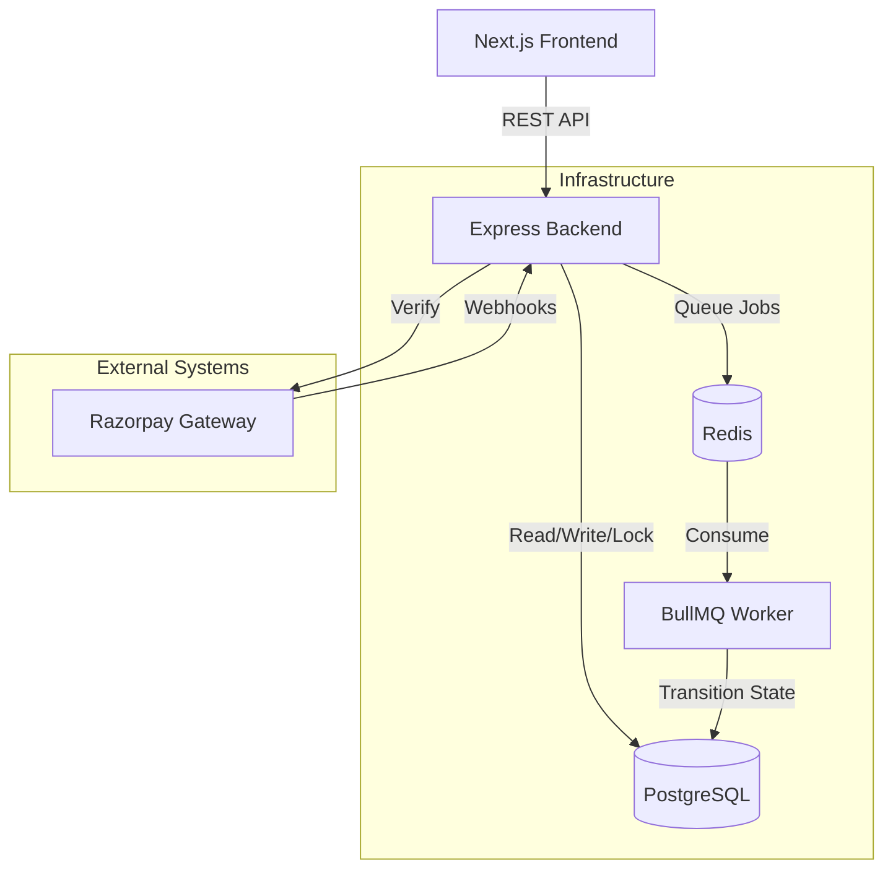

<div align="center">
  <h1>ShopSmart</h1>
  <p><b>Production-grade Full Stack Commerce Platform</b></p>
  <p>Architected with Next.js, Express, TypeScript, Prisma, PostgreSQL, Redis, BullMQ, and Razorpay.</p>

  
  
  
  
  
  
  
  
  
</div>

---

## 📖 Overview

ShopSmart is a robust, transactional e-commerce platform designed with production readiness and industrial-scale architecture in mind. 

Far from a simple CRUD application, ShopSmart implements complex state machines, strict concurrency locking mechanisms, external payment webhook ingestion, and resilient queue-based event processing.

## ✨ Key Features

- **Robust Authentication & Authorization**: JWT-based authentication combined with rigorous Policy-Based Access Control (PBAC).
- **Transactional Commerce Engine**: Utilizes PostgreSQL row-level locks (`SELECT ... FOR UPDATE`) sorted dynamically to prevent deadlocks during high-concurrency checkout bursts.
- **Payment Gateway Abstraction**: Interfaces natively with Razorpay via secure, dynamic loading and backend-verified signatures using `express.raw()`.
- **Asynchronous Webhook Processing**: Replaces synchronous API chokepoints with asynchronous BullMQ workers. Incorporates `ProcessedWebhook` PG constraints to guarantee idempotency during webhook storms.
- **Order State Machine**: A strict, unified state transition boundary (`OrderStateMachine`) ensures orders traverse statuses (`PENDING` → `PAYMENT_PENDING` → `CONFIRMED` → `PROCESSING`) deterministically.
- **Centralized Error Handling**: Standardized `AppError` envelopes combined with asynchronous catch wrappers (`catchAsync`).
- **Comprehensive Logging & Auditing**: Winston structured logging and dedicated `OrderAuditLog` trails for financial accountability.
- **Modern Frontend State**: Zustand for deterministic client state (`checkoutStore`) combined with `@tanstack/react-query` for server-state caching, invalidation, and retries.

## 🏗️ Architecture



For more detailed diagrams, see the [`docs/architecture`](./docs/architecture) folder.

## 🛠️ Tech Stack

### Frontend
- **Framework**: Next.js 16 (App Router)
- **Language**: TypeScript
- **State Management**: Zustand (Client State), TanStack React Query (Server State)
- **Styling**: Tailwind CSS
- **Validation**: Zod (Shared schemas with Backend)

### Backend
- **Framework**: Node.js & Express 5
- **Language**: TypeScript
- **Database ORM**: Prisma
- **Database Engine**: PostgreSQL 15
- **Cache & Queueing**: Redis 7 & BullMQ
- **Payment Processing**: Razorpay
- **Validation**: Zod
- **Testing**: Vitest

### Infrastructure & DevOps
- **Containerization**: Multi-stage Docker & Docker Compose
- **CI/CD**: GitHub Actions
- **API Documentation**: OpenAPI 3.0 / Swagger UI

## 📂 Repository Layout

```text
shopsmart/
├── .github/                # CI/CD workflows and GitHub templates
├── client/                 # Next.js Frontend (Feature-based Architecture)
│   ├── src/
│   │   ├── app/            # Next.js App Router routing
│   │   ├── features/       # Feature-sliced domains (auth, products, checkout, etc.)
│   │   ├── shared/         # Shared UI components and hooks
│   │   └── lib/            # API client and external integrations
├── server/                 # Express API Backend
│   ├── src/
│   │   ├── modules/        # Domain-driven feature modules
│   │   ├── queues/         # BullMQ queue definitions
│   │   └── workers/        # Background job processors
│   └── prisma/             # Database schema and migrations
├── packages/               # Monorepo Shared Packages
│   ├── shared-types/       # Shared TypeScript interfaces and Zod schemas
│   └── shared-utils/       # Shared utility functions
├── terraform/              # Infrastructure as Code (AWS)
│   ├── environments/       # Environment configurations (e.g. production)
│   └── modules/            # Reusable IaC modules (compute, networking, security)
├── scripts/                # Development and deployment bash scripts
├── docs/                   # Project Documentation
│   ├── adr/                # Architecture Decision Records
│   └── architecture/       # Mermaid diagrams and high-level docs
└── docker-compose.yml      # Local development infrastructure
```

## 🚀 Getting Started

### Prerequisites
- Node.js 20+
- pnpm 10+
- Docker & Docker Compose

### Local Development

1. **Clone & Install**
   ```bash
   git clone https://github.com/your-username/shopsmart.git
   cd shopsmart
   pnpm install
   ```

2. **Start Infrastructure**
   Boot up PostgreSQL and Redis locally:
   ```bash
   docker compose up -d db redis
   ```

3. **Configure Environment**
   Copy the example environment files and fill in your local credentials:
   ```bash
   cp server/.env.example server/.env
   cp client/.env.example client/.env
   ```

4. **Initialize Database**
   ```bash
   cd server
   pnpm prisma migrate deploy
   pnpm prisma generate
   ```

5. **Start Development Servers**
   In the root directory:
   ```bash
   pnpm dev
   ```
   - Frontend runs on `http://localhost:3000`
   - Backend API runs on `http://localhost:5001/api`
   - Swagger Documentation runs on `http://localhost:5001/api-docs`

## 🧪 Testing

The platform is heavily tested using Vitest for both unit and integration tests.

```bash
# Run all tests
pnpm test

# Run backend tests only
pnpm --filter server test

# Run frontend tests only
pnpm --filter shopsmart-frontend test
```

## 🌐 API Documentation

ShopSmart includes a comprehensive OpenAPI 3.0 specification. 
When the server is running, navigate to **[http://localhost:5001/api-docs](http://localhost:5001/api-docs)** to view the interactive Swagger UI playground.

Alternatively, you can view the raw YAML specification in [`docs/api/openapi.yaml`](./docs/api/openapi.yaml).

## 🚢 Deployment Strategy

ShopSmart is designed to be cloud-agnostic. The recommended deployment topology is:
- **Frontend**: Vercel
- **Backend**: Railway or Fly.io (Dockerized)
- **Database**: Neon (Serverless Postgres)
- **Cache/Queue**: Upstash (Serverless Redis)

For production deployment, ensure the environment variable `NODE_ENV=production` is set, and utilize the included multi-stage `Dockerfile`s for optimized image builds.

---
*Developed as a production-grade demonstration of scalable e-commerce architecture.*
