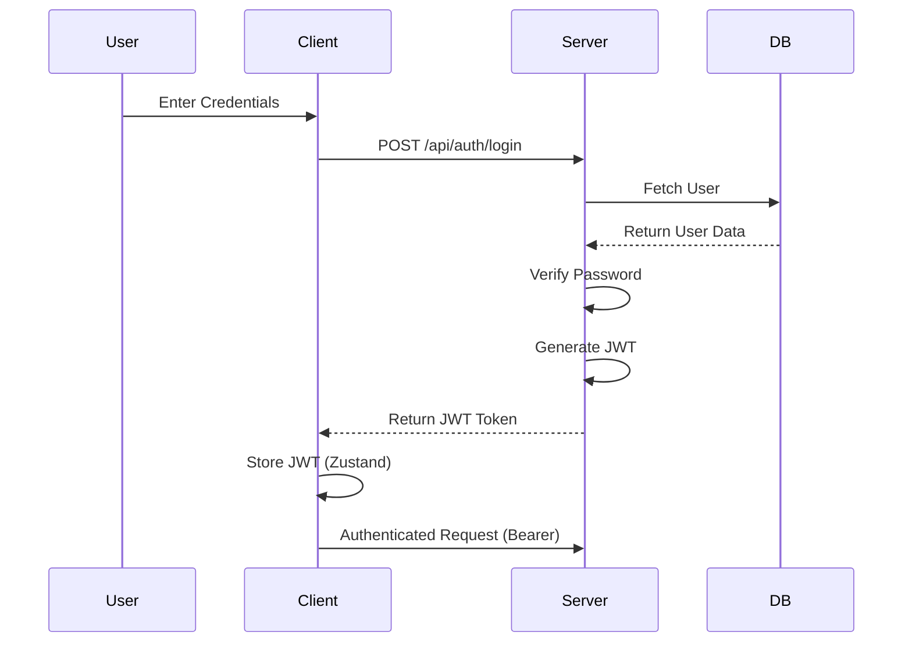

# Authentication Flow

```mermaid
sequenceDiagram
    participant User
    participant Client
    participant Server
    participant DB
    
    User->>Client: Enter Credentials
    Client->>Server: POST /api/auth/login
    Server->>DB: Fetch User
    DB-->>Server: Return User Data
    Server->>Server: Verify Password
    Server->>Server: Generate JWT
    Server-->>Client: Return JWT Token
    Client->>Client: Store JWT (Zustand)
    Client->>Server: Authenticated Request (Bearer)
```
