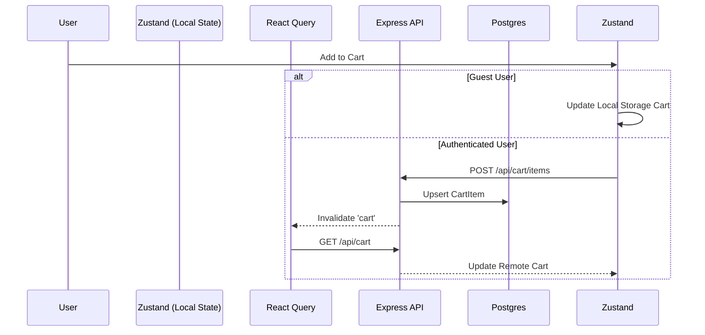

# Cart Flow

```mermaid
sequenceDiagram
    participant User
    participant Zustand (Local State)
    participant React Query
    participant Express API
    participant Postgres
    
    User->>Zustand: Add to Cart
    
    alt Guest User
        Zustand->>Zustand: Update Local Storage Cart
    else Authenticated User
        Zustand->>Express API: POST /api/cart/items
        Express API->>Postgres: Upsert CartItem
        Express API-->>React Query: Invalidate 'cart'
        React Query->>Express API: GET /api/cart
        Express API-->>Zustand: Update Remote Cart
    end
```
