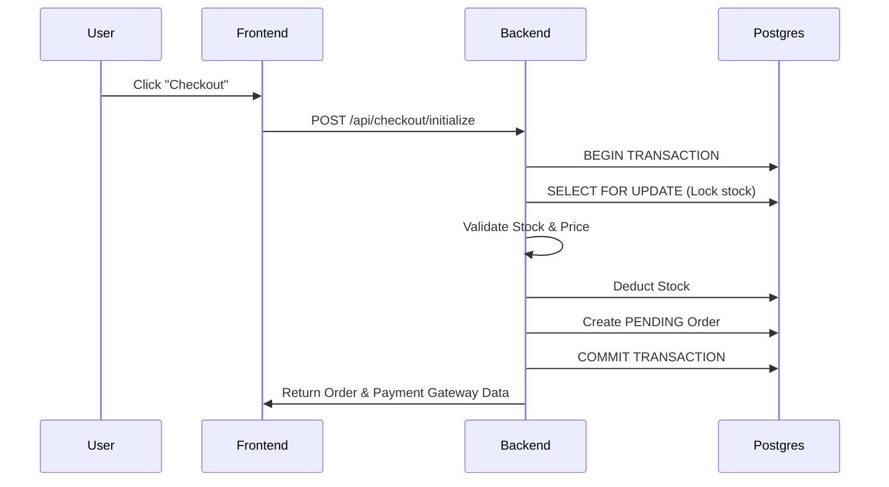

# Checkout Flow

```mermaid
sequenceDiagram
    participant User
    participant Frontend
    participant Backend
    participant Postgres
    
    User->>Frontend: Click "Checkout"
    Frontend->>Backend: POST /api/checkout/initialize
    
    Backend->>Postgres: BEGIN TRANSACTION
    Backend->>Postgres: SELECT FOR UPDATE (Lock stock)
    Backend->>Backend: Validate Stock & Price
    Backend->>Postgres: Deduct Stock
    Backend->>Postgres: Create PENDING Order
    Backend->>Postgres: COMMIT TRANSACTION
    
    Backend->>Frontend: Return Order & Payment Gateway Data
```
