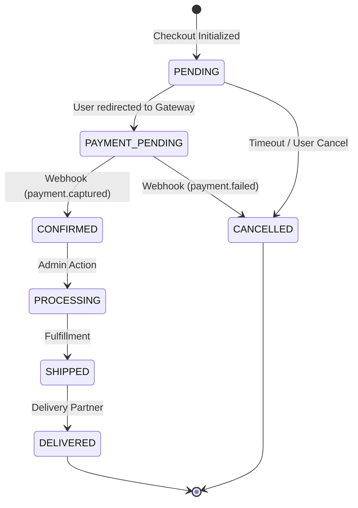

# Order State Machine

```mermaid
stateDiagram-v2
    [*] --> PENDING : Checkout Initialized
    
    PENDING --> PAYMENT_PENDING : User redirected to Gateway
    PENDING --> CANCELLED : Timeout / User Cancel
    
    PAYMENT_PENDING --> CONFIRMED : Webhook (payment.captured)
    PAYMENT_PENDING --> CANCELLED : Webhook (payment.failed)
    
    CONFIRMED --> PROCESSING : Admin Action
    PROCESSING --> SHIPPED : Fulfillment
    SHIPPED --> DELIVERED : Delivery Partner
    
    DELIVERED --> [*]
    CANCELLED --> [*]
```
