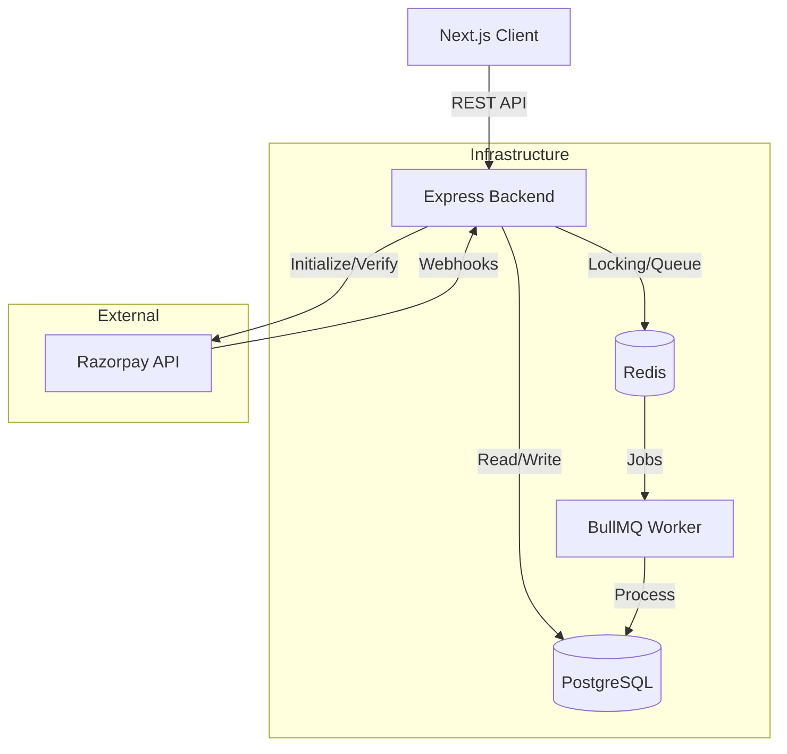

# System Architecture

```mermaid
graph TD
    Client[Next.js Client] -->|REST API| Server[Express Backend]
    
    subgraph Infrastructure
        Server -->|Read/Write| Postgres[(PostgreSQL)]
        Server -->|Locking/Queue| Redis[(Redis)]
        Redis -->|Jobs| BullMQ[BullMQ Worker]
        BullMQ -->|Process| Postgres
    end
    
    subgraph External
        Server -->|Initialize/Verify| Razorpay[Razorpay API]
        Razorpay -->|Webhooks| Server
    end
```
