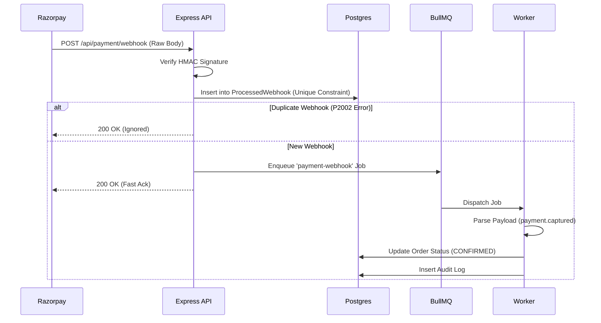

# Payment Webhook Flow

```mermaid
sequenceDiagram
    participant Razorpay
    participant Express API
    participant Postgres
    participant BullMQ
    participant Worker
    
    Razorpay->>Express API: POST /api/payment/webhook (Raw Body)
    Express API->>Express API: Verify HMAC Signature
    Express API->>Postgres: Insert into ProcessedWebhook (Unique Constraint)
    
    alt Duplicate Webhook (P2002 Error)
        Express API-->>Razorpay: 200 OK (Ignored)
    else New Webhook
        Express API->>BullMQ: Enqueue 'payment-webhook' Job
        Express API-->>Razorpay: 200 OK (Fast Ack)
        
        BullMQ->>Worker: Dispatch Job
        Worker->>Worker: Parse Payload (payment.captured)
        Worker->>Postgres: Update Order Status (CONFIRMED)
        Worker->>Postgres: Insert Audit Log
    end
```
